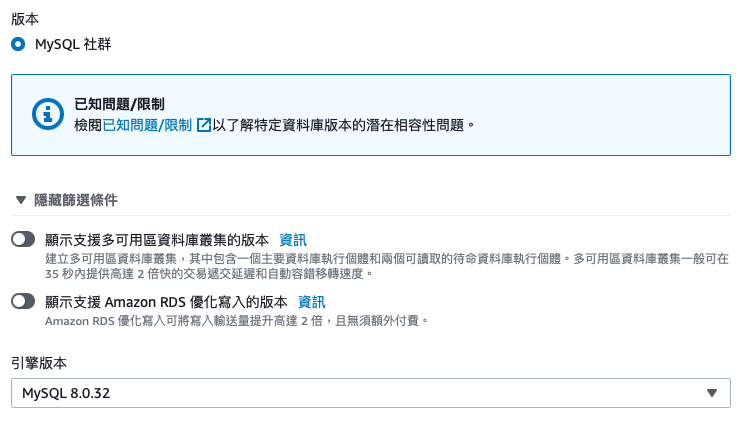

## 事前準備

以下為本文使用的環境和專案介紹：

* Operating System: macOS
* Project: Todo List (Express.js + Sequelize + MySQL)

### Sign Up AWS Account

到 [AWS 網站](https://portal.aws.amazon.com/billing/signup#/start/email)進行註冊，要綁定信用卡和手機認證。

註冊完成之後則啟用為期一年的免費方案，如果有其他考量的話可以使用[假信箱](https://10minutemail.com)註冊。

### Apply Security Credentials

於 [AWS Portal](https://us-east-1.console.aws.amazon.com/iamv2/home#/security_credentials) 內申請部署時會使用到的 `Access Key ID` 和 `Secret Access Key`。

* 點選**建立存取金鑰**


* 點選同意和下一步

> 實務上會開一個 Root User，並於 Root User 下開不同權限的 User 帳號，不會像我們這樣直接建立 Credentials。


* 取得 Credentials 資料


### Install Elastic Beanstalk CLI

根據不同環境，參考[步驟](https://docs.aws.amazon.com/elasticbeanstalk/latest/dg/eb-cli3-install-advanced.html)的說明，將 EB CLI 安裝完成。

## 開始部署

### In Terminal

請先將 Terminal 切換到部署的專案資料夾底下，再依序操作以下指令。

#### eb init

```bash
$ eb init
```

輸入指令後，會有一連串需要設定的東西:

* Server Region: 選擇伺服器地區，選跟自己所在的位置越近的地區連線會越穩定。

:::warning[WARNING]
要與 AWS Portal 上的地區一致，否則會因為地區不同，之後在 AWS Portal 上會看不到部署的專案。
:::

* Access Key & Sercret Key: 輸入之前取得的 Credentials 資料。

* Application Name: 輸入應用程式的名稱。

* Programming Language & Platform: 輸入使用的程式語言以及版本。

* SSH: 選擇是否需要設定 SSH 連線。

:::warning[WARNING]
後面會使用 EC2 Instance 連線到資料庫去建立 DB，因此需要選 **Y**。
:::

如果可以在專案資料夾內看到一個隱藏的資料夾 `.elasticbenstalk`，就代表 `eb init` 的設定都完成了。

#### eb create

現在要正式地把專案建立於 AWS 上。

```bash
$ eb create
```

輸入指令之後又會需要設定一些東西，不過只要直接跟著預設的選項去進行處理就好了，只有 `Spot Fleet request` 需要選擇 **Ｎ**。

完成所有設定之後就會開始把專案建立在 AWS 上，如果看到 `Successfully launched environment: <Environment Name>` 就代表建立成功囉！

:::info[TIP]
也可以透過 AWS Portal (EC2、Elastic Beanstalk、S3) 確認建立結果。
:::

### In AWS Portal

將專案建立在 AWS 後，要回到 AWS Portal 開始進行建立資料庫、設定環境變數。

#### Create Database

來到 [AWS RDS](https://ap-northeast-1.console.aws.amazon.com/rds/home)，開始建立 MySQL 資料庫。


基本上都是用預設的配置，不過有幾個需要注意的地方：

* Creation Method & Engine Options: 選擇 Standard Create 且 Engine Type 與自己專案內使用的資料庫一致，Version 則需要確認是否與專案內使用的版本相差不多。




* Template: 如果是想使用免費服務，記得要選 Free Tier。


* Settings: 設定資料庫名稱，以及設定之後連線到資料庫的帳號密碼。

:::warning[WARNING]
因為之後會使用資料庫密碼進行身份驗證，所以這組帳號密碼不能忘記喔。
:::


* Storage: 如果是想使用免費服務，Allocated Storage 記得調成 20 GiB。


* Connectivity: 為了要讓伺服器可以自動連線到目前建立的資料庫，這步驟要設定成 Connect to an EC2 compute resource，並在下方選項可以找到剛剛建立出來的 EC2 Instance。

:::tip[TP]
建立 EB 會自動建立一個 EC2 資源。
:::


* Additional Configuration: 如果是想使用免費服務，記得要關掉自動備份的功能。


#### Set Configuration

來到 [AWS EB](https://ap-northeast-1.console.aws.amazon.com/elasticbeanstalk/home) 設定 Todo List 專案的環境變數 (`Environment -> your project -> Configuration -> Software`)，把專案內會用到的環境變數都填寫在此。

包含資料庫的連線設定 `mysql://admin:password@<Database Endpoint>/<DB NAME>`。


* Database Endpoint: 在剛剛創建的 Database 中找到 Endpoint。


* DB Name: 待會會創建的 Database Name，可先自行定義名稱。

#### Create Database Name

來到 [EC2](https://ap-northeast-1.console.aws.amazon.com/ec2/home) 並透過 EC2 Instance 內的連線，去連接到資料庫。

如果看到類似網頁版的終端機就代表成功：


接著去連接 AWS 內創建的 MySQL 資料庫：

```SQL
mysql -h <Database Endpoint> -u admin -p
```

* **-h Database Endpoint**： 指定 Database Endpoint，指的是剛剛創建的 Database 內的 Endpoint。

* **-u admin**： 指定要使用的 MySQL 使用者名稱，指的是一開始創建資料庫時的名稱 **admin**。

* **-p**： 要求需要輸入密碼進行身份驗證，會需要需入一開始創建資料庫時輸入的密碼。

確認成功連接上之後，就可以輸入以下 SQL 指令，去創建在環境變數時命名的 DB name 了：

```SQL
create database <DB NAME>;
```

### Deploy

#### Migration When Deploying

為了在每次部署的時候都同時執行 Migration，可以透過在程式內設定 Commands 來做到。

:::info[RECOMMENDATION]
[Developer Guide](https://docs.aws.amazon.com/elasticbeanstalk/latest/dg/customize-containers-ec2.html#linux-container-commands)
:::

在專案資料夾內依照下面路徑建立 Migration Commands：

```JSON title="./.ebextensions/migration.config"
container_commands: // 部署之後會自動完成以下設定的 commands ("npm run dbmigrate")
  database_migration: // 可自定義 command 的名稱
    leader_only: true // 只有被指定為 leader 的這台伺服器才會執行這個指令
    command: "npm run dbmigrate"
```

於 `package.json` 中放入該指令 `npm run dbmigrate`。

```JSON title="./package.json"
"scripts": {
  "start": "node app.js",
  "dev": "nodemon app.js",
  "test": "echo \"Error: no test specified\" && exit 1",
  // highlight
  "dbmigrate": "npx sequelize db:migrate && npx sequelize db:seed:all"
},
```

#### eb deploy

```bash
$ eb deploy
```

:::warning[WARNING]
EB 部署是抓最新一筆 git 的 commit。
:::

當看到 `Environment update completed successfully.` 就代表部署成功。

可以回到 [AWS EB](https://ap-northeast-1.console.aws.amazon.com/elasticbeanstalk/home) 找到部署成功後的網址。


### Terminate

如果需要中斷 Elastic Beanstalk 服務，可以透過以下指令來中斷：

```bash
$ eb terminate
```

:::info[REFERENCE]
* ALPHA Camp
* [AWS Elastic Beanstalk](https://docs.aws.amazon.com/elastic-beanstalk/index.html)
:::