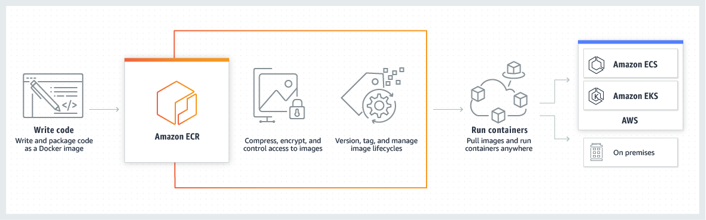

:::tip[PREFACE]
**AWS ECR (Elastic Container Registry)**

AWS 用來提供存放 Docker Image 的服務，可以依照需求建立 Public Repository (Docker Hub) 或是 Private Repository (透過 IAM 進行安全控管)。

能與 Elastic Container Service（ECS）和 Elastic Kubernetes Service（EKS）整合，ECS 跟 EKS 簡單的存取 ECR 內的 Image。


:::

## Authorization

進行以下操作前，都需要先安裝並配置好 AWS CLI，並確保有對 ECR 操作的權限：

```bash
aws configure
```

### Receive ECR Credential

```bash
aws ecr get-login-password --region <your-region>
```

### Login Docker

```bash
docker login --username AWS --password-stdin <aws-account-id>.dkr.ecr.<your-region>.amazonaws.com
```

## Pull Image

將 AWS ECR 內的 Image 拉下來本地：

```bash
docker pull <aws-account-id>.dkr.ecr.<your-region>.amazonaws.com/<your-repository-name>:<tag>
```

## Push Image

將本地的 Image 推上去 AWS ECR：

### Tag

* Repository 名稱要跟為 Image 創建的 Respository 名稱相同
* Tag 可以省略，預設為 `latest`

```bash
docker tag <local-image>:<tag> <aws-account-id>.dkr.ecr.<your-region>.amazonaws.com/<your-repository-name>:<tag>
```

### Push

```bash
docker push <aws-account-id>.dkr.ecr.<your-region>.amazonaws.com/<your-repository-name>:<tag>
```

## Operation

### List Repositories

```bash
aws ecr describe-repositories
```

### List Tags In Image

```bash
aws ecr list-images --repository-name <repository-name> --region <your-region>
```

### Get Images In Repositories

```bash
aws ecr describe-repositories --repository-name <repository-name>
```

:::info[REFERENCE]
* [Pulling an image to your local environment from an Amazon ECR private repository](https://docs.aws.amazon.com/AmazonECR/latest/userguide/docker-pull-ecr-image.html)
* [Pushing a Docker image to an Amazon ECR private repository](https://docs.aws.amazon.com/AmazonECR/latest/userguide/docker-push-ecr-image.html)
:::