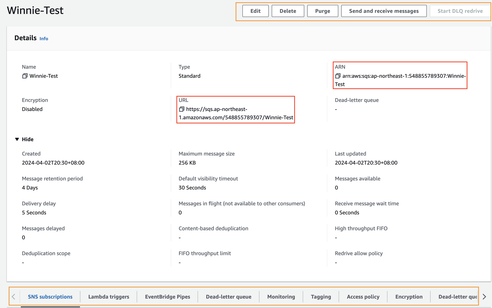

import CenterImage from "@site/src/components/helpers/CenterImage";

:::tip[PREFACE]
**Message Queue**

一個訊息佇列，當發送方 (Producer) 產生資料傳送給接收方 (Consumer) 過程中，用來存放 Message 的緩衝區。

由於先進先出 (FIFO) 的特性，Producer 只要將 Message 往 Queue 內丟， Consumer 就能依序從 Queue 中取出訊息，使雙方能夠獨立運作，不需要放在同一套系統內，提高了執行效率，也降低了 Worker 的耦合性。

[Message Queue 介紹與實際應用](https://enzochang.com/message-queue-introduction/)


:::

## What is SQS

Amazon Simple Queue Service (SQS) 是一種全受管訊息佇列服務 (可讓使用者存取訊息佇列的 Web 服務)，提供可靠、安全且可高度擴展的託管佇列服務。

通過使用 SQS，可以在各個程式間發送、存儲和接收消息，而不會丟失消息或要求每個程式同時可用，確保了應用架構更具有彈性和靈活性。

## Feature

> 同時傳送和讀取訊息。
>
> 保留佇列中的訊息，最多 14 天。

* 全管理服務：AWS 處理所有持續的操作和底層基礎設施，負責訊息佇列的建立、設計和維護
* 可擴展性：SQS 支援大規模的訊息處理，能夠處理大量訊息，隨著應用需求自動擴展，無需任何前期成本或配置
* 安全性：提供數據加密、訪問控制和身份驗證機制，確保訊息的安全性和隱私
* 訊息延遲：可以設定訊息的延遲傳遞，以便在一定時間後訊息變為可用
* 可靠性：訊息在多個服務器和數據中心冗餘存儲，即使發生故障也不會丟失訊息，確保訊息的可靠傳遞

## Architecture

### Distributed Queues

分散式佇列，其主要由三個部分所組成：

* 分散式系統的元件
* 佇列 (Distributed on Amazon SQS servers)
* 在 Queue 內的 Message

<CenterImage src="https://docs.aws.amazon.com/images/AWSSimpleQueueService/latest/SQSDeveloperGuide/images/ArchOverview.png" alt="Distributed Queues"/>

Amazon SQS 將發送到 Queue 的訊息以備援方式存放在多個 Amazon SQS 伺服器上，以確保高可用性和訊息的耐用性。

但並不是每台 Server 都儲存所有的 Message，不同的 Server 可能儲存不同的 Message。

### Message Lifecycle

> 只要符合服務限制，SQS 允許發送任何類型的訊息，無論是 JSON、XML 或是純文字。
>
> Message 的大小是可以從 1 byte ~ 256 KB，超過 256 KB 的 Payload 會需要以 Reference 的方式放到 S3，不能直接傳到 SQS 中

<CenterImage src="https://docs.aws.amazon.com/images/AWSSimpleQueueService/latest/SQSDeveloperGuide/images/sqs-message-lifecycle-diagram.png" alt="SQS Message Lifecycle"/>

1. 傳送訊息的 Worker 呼叫 `SendMessage` 將新訊息傳送到佇列。

2. 處理訊息的 Worker 呼叫 `ReceiveMessage` 取得在 Queue 內的訊息，並將此訊息回傳。

:::warning[NOTICE]
一旦訊息是因為被取得而回傳，該訊息就會進入 Invisible 的狀態，除非可見性逾時 (Visibility Timeout)，否則不會由其他 Worker 透過 `ReceiveMessage` 取得。

--> 避免多個 Worker 同時處理相同的訊息。
:::

3. 處理訊息的 Worker 若順利完成此訊息處理，便會呼叫 `DeleteMessage` 將此訊息從佇列中移除，系統就不會再次處理該訊息。

:::warning[NOTICE]
Worker 若無法處理訊息，只要 Visibility Timeout 已過，便會由其他 Worker 呼叫 `ReceiveMessage` 讀取訊息。
:::

## Queue Type

訊息佇列的類型：

### Standard Queue

* 預設的 Queue Type
* 每秒可以承受的訊息量極大，可以當作是無限傳輸量
* 確保每個訊息都至少被傳送一次，偶爾會傳遞一個以上的訊息副本
* 盡力按順序傳遞，有時會有傳送順序不一致的情況

<CenterImage src="https://d1.awsstatic.com/AmazonSQS/sqs-what-is-sqs-standard-queue-diagram.29963b2823bc048492c7af2757535d500aa2c159.png" alt="Standard Queue Type"/>

### FIFO Queue

基本包含了 Standard Queue 中所有的功能，不過有以下不同：

* 保證順序一致，先進先出
* 每個訊息只會被傳送一次，不會重複發送

<CenterImage src="https://d1.awsstatic.com/AmazonSQS/sqs-what-is-sqs-fifo-queue-diagram.8f1c8d366f58845ce03bb2983c16349102cf1524.png" alt="FIFO Queue Type"/>

## Polling Type

訊息的接收方式：

### Long Polling

* Request 量較少，成本較低
* Worker 向 SQS 呼叫 `ReceiveMessage` 時，SQS 會等到 Queue 中有訊息或是 Timeout (最長 20 秒) 到了才回應

### Short Polling

* 預設使用的 Polling Type
* 較為即時性，但 Request 量較多，成本較高
* Worker 向 SQS 呼叫 `ReceiveMessage` 時，無論 Queue 是否有任何訊息，SQS 會立即回應 (無訊息則回應 Empty)

## Usage

完成建立的 AWS Queue 在 Console 內會如下圖所示：



可以直接透過 AWS Console 查看 Queue 的設定，並進行修改、刪除或是傳送及接收訊息等操作，並實時監測訊息的傳送狀況等等。

此外，也可以透過 AWS SDK 來操作，不過一定要有以下資訊：

* Queue URL (AWS Console 顯示的 URL)
* 有權限存取該 Queue 的 Credential 或 Profile

```php
<?php

use Aws\Sqs\SqsClient;
use Aws\Exception\AwsException;

$sqsClient = new SqsClient([
    'region' => 'ap-northeast-1',
    'version' => 'latest',
    // choose one: profile or credentials
    'profile' => 'YOUR_PROFILE',
    'credentials' => [
        'key' => 'YOUR_CREDENTIALS_KEY',
        'secret' => 'YOUR_CREDENTIALS_SECRET_KEY',
    ]
]);

$queueUrl = 'https://sqs.ap-northeast-1.amazonaws.com/548855789307/Winnie-Test';

```

### SendMessage

```php
<?php

$messageBody = json_encode(['song_id' => 1234]);

$params = [
    'DelaySeconds' => 10,
    'MessageAttributes' => [
        "Title" => [
            'DataType' => "String",
            'StringValue' => "SQS Message Sent song_id"
        ],
        "Author" => [
            'DataType' => "String",
            'StringValue' => "Winnie Lin"
        ],
        "WeeksOn" => [
            'DataType' => "Number",
            'StringValue' => "6"
        ]
    ],
    'MessageBody' => $messageBody,
    'QueueUrl' => $queueUrl
];

try {
    $result = $sqsClient->sendMessage($params);
    echo "Message Sent!" . PHP_EOL;
    echo "Message ID: " . $result->get('MessageId') . "\n"; // 發送訊息的唯一識別
} catch (AwsException $e) {
    error_log($e->getMessage());
}
```

* DelaySeconds：當訊息被發送到佇列之後，多少秒後才為可見 (Optional)
* MessageAttributes：將自定義的屬性新增到訊息上 (Optional)
* MessageBody：訊息的主體內容，發送到 SQS 佇列的實際資料，也是根據這部分資料來進行邏輯處理 (Required)

### ReceiveMessage

> 使用非同步批量接收訊息及刪除訊息

```php
<?php
use GuzzleHttp\Promise\Utils;

try {
    $result = $sqsClient->receiveMessageAsync([
        'AttributeNames' => ['SentTimestamp'],
        'MaxNumberOfMessages' => 5,
        'MessageAttributeNames' => ['All'],
        'QueueUrl' => $queueUrl,
        'WaitTimeSeconds' => 5,
    ]);

    for ($i = 0; $i < 10; $i++) {
      $promises[] = $sqsClient->receiveMessageAsync([
          'AttributeNames' => ['SentTimestamp'],
          'MaxNumberOfMessages' => 10,
          'QueueUrl' => $queueUrl,
          'MessageAttributeNames' => ['All'],
          'WaitTimeSeconds' => 5,
      ]);
    }

    $response = [];
    foreach ($results as $result) {
      $data = $result->get('Messages');
      // 可能拿到 NULL
      if (!is_array($data)) {
        continue;
      }
      $response = array_merge($response, $data);
    }

    if (!empty($response)) {
        $deleteMessages = [];
        foreach ($response as $message) {
            $deleteMessages[] = [
                // 每個刪除請求的唯一識別符
                'Id' => $message['MessageId'],
                // 用於刪除訊息的憑證
                'ReceiptHandle' => $message['ReceiptHandle']
            ];
            echo "Message Body: " . $message['Body'] . PHP_EOL; // Message Body: {"song_id":1234}
            echo "Message Deleted!" . PHP_EOL;
            echo "ReceiptHandle: " . $message['ReceiptHandle'] . "\n";
        }

        if (!empty($deleteMessages)) {
            // 執行批量刪除
            $promise = $sqsClient->deleteMessageBatchAsync([
                'QueueUrl' => $queueUrl,
                'Entries' => $deleteMessages
            ]);
            $promise->wait();
        }
    } else {
        echo "No messages in queue. \n";
    }
} catch (AwsException $e) {
    error_log($e->getMessage());
}
```

:::warning[NOTICE]
Delete Message 時一定要有 ReceiptHandle。

由於使用非同步批次刪除 `deleteMessageBatchAsync`，因此需要傳入 MessageId 和 ReceiptHandle。
:::

* AttributeNames：返回 AWS SQS 訊息的內建屬性 (Optional)
  * `SentTimestamp` 每條訊息的發送時間戳
  * `SenderId` 訊息發送者的 AWS ID
  * `ApproximateReceiveCount` 訊息被接收的次數
* MessageAttributeNames：返回訊息內的自定義的屬性 (Optional)
* MaxNumberOfMessages：最多可以接受的訊息數量，預設值是 1，最大值為 10 (Optional)
* WaitTimeSeconds：指定 Long Polling 的等待時間，預設是 0 也就是 Short Polling (Optional)

:::info[REFERENCE]
* [Basic Amazon SQS architecture](https://docs.aws.amazon.com/AWSSimpleQueueService/latest/SQSDeveloperGuide/sqs-basic-architecture.html)
* [Amazon SQS features](https://aws.amazon.com/sqs/features)
* [aws-doc-sdk-examples](https://github.com/awsdocs/aws-doc-sdk-examples/tree/main/php/example_code/sqs)
* [Managing an Amazon SQS queue](https://docs.aws.amazon.com/AWSSimpleQueueService/latest/SQSDeveloperGuide/sqs-managing-a-queue.html)
:::