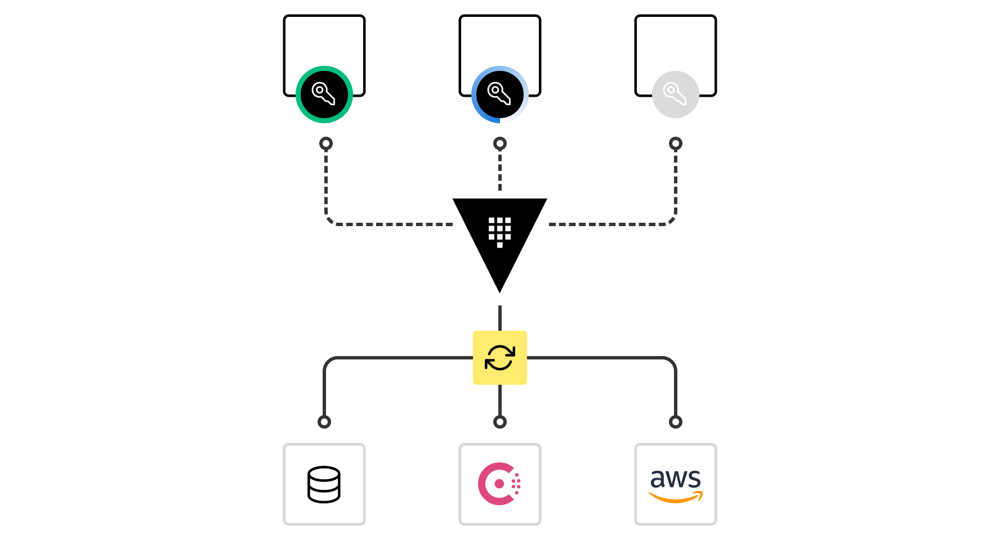
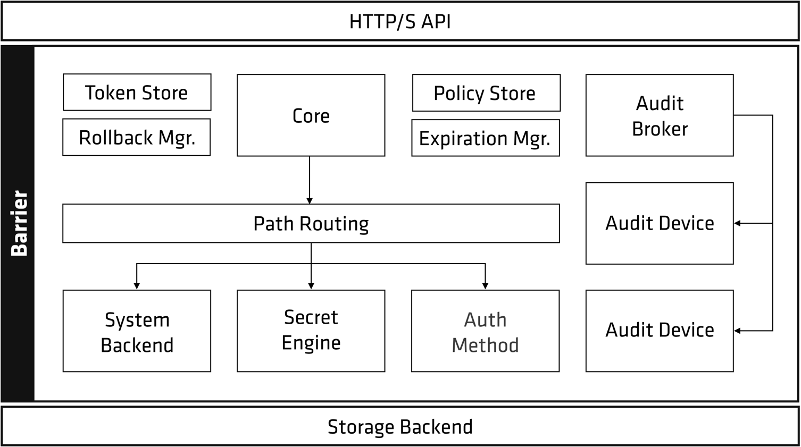
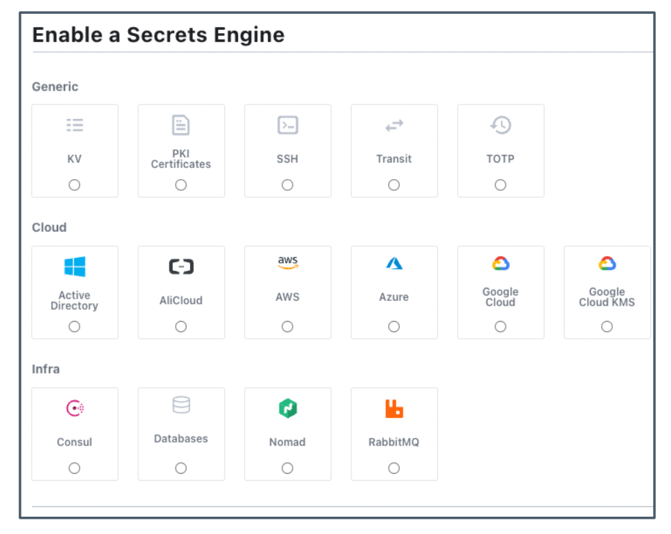
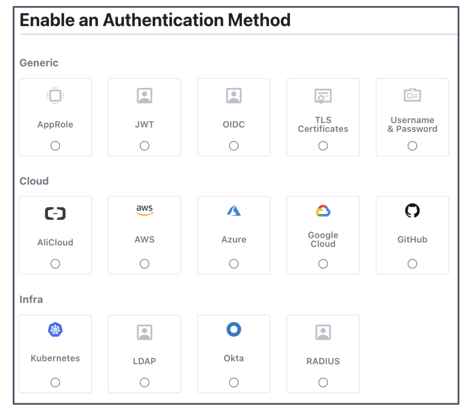
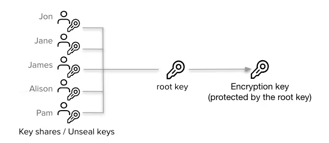
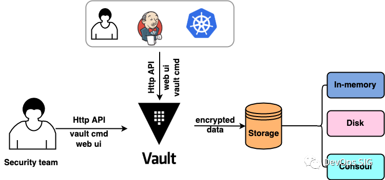
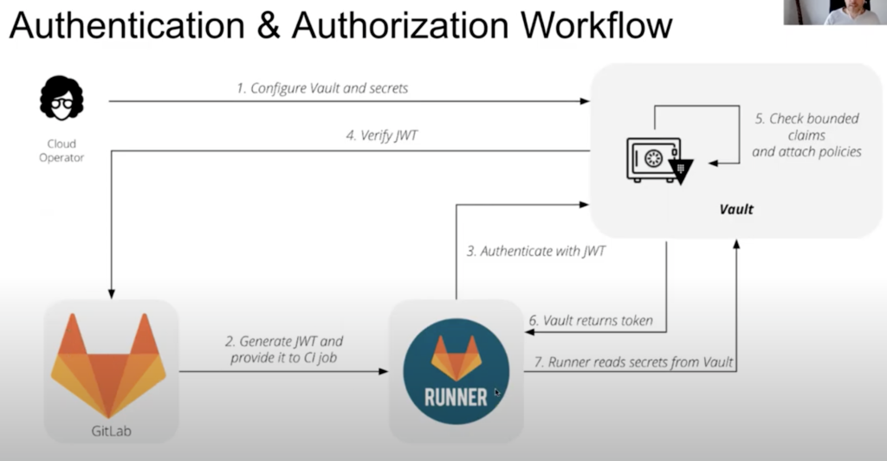
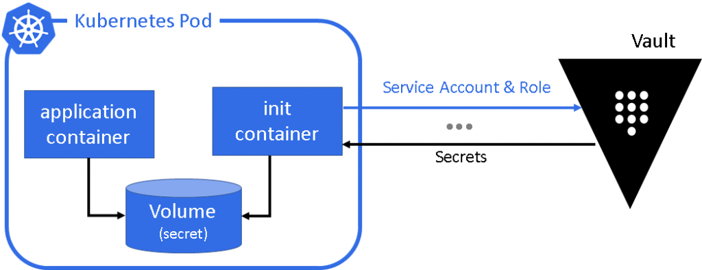
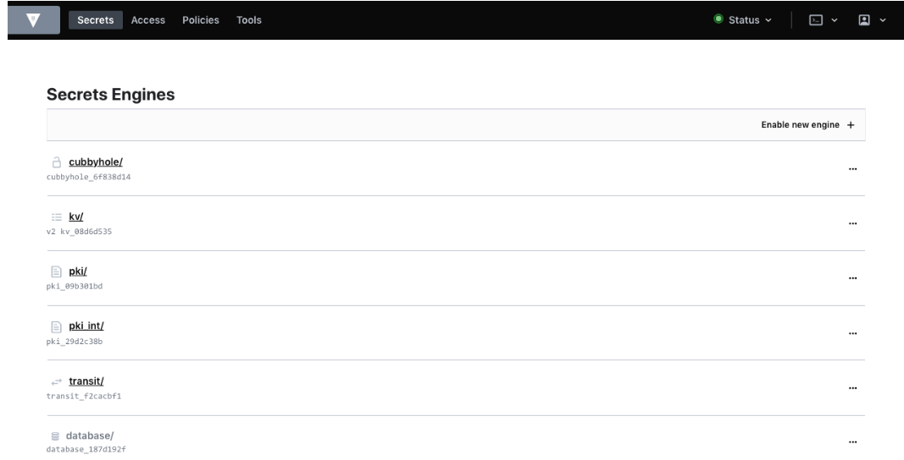

## What is Vault



[Vault](https://www.gaia.net/tc/brands_detail/0/0/88/hashicorp-vault) 是由 HashiCorp 主導開發用於管理機密資料的開源專案，採用中心化的機密管理方式來減少機密暴露的風險。

所有儲存在 Vault 內的資料都會經過加密，管理者可以透過 Token 或是開設不同的帳號來限制不同的存取範圍，而所有的存取紀錄都會透過 Audit 模組記錄下來。

除此之外，Vault 能夠動態地產生 Credential 並設定期限，當期限到期時，Vault 會自動撤銷該 Credential。

### Vault Component



* Storage Backend：負責儲存加密資料。

* Secret Engines：負責儲存、建立、管理 Secret 或者加密資料，相同類型的 Secret Engine 可透過 Path 啟用或隔離。



* Authentication Methods：負責為使用者指派 Identity 和 Policy，當通過身份認證，Vault 會發出一組 Token 用於後續的 Request。



* Audit Devices：紀錄 Vault 所有 Request 和 Response 的 Log，並在寫入以前用 Hash 處理。

### Vault Concept

* Token：是 Vault 進行身份驗證的核心方式，所有對 Vault 的 Request 都必須有 Token，而每個 Token 都會有關聯的 Policy 和 TTL (Time To Live)。

* Path：Vault 的所有操作都是 Path-Based，但仍有一些無法使用或刪除的系統保留路徑 `auth/`、`sys/`、`secret/`、`identity/`、`cubbyhole/`。

* Policy：設定訪問權限，預設的 Policy 都是 Deny。

* Seal：Vault Server 起始狀態為 Seal，不能進行任何操作，預設使用 [Shamir's secret sharing](https://en.wikipedia.org/wiki/Shamir%27s_secret_sharing)。

:::tip[QUOTE]
Instead of distributing the unseal key as a single key to an operator, Vault uses an algorithm known as Shamir's Secret Sharing to split the key into shares. A certain threshold of shares is required to reconstruct the unseal key, which is then used to decrypt the root key.
:::

* Unseal：重構 Master Key 以解密 Encryption Key 的過程。



## 使用場景



1. Infra Team 通過 HTTP-Vault-API、Vault 命令行工具 (CLI) 或是 Vault Web UI 將 Secret Data 寫入 Vault。

2. Vault 再將加密的數據儲存到 Storage Backend。

3. 外部用戶通過 HTTP-Vault-API 或是 Vault 命令行工具等方式來獲取與自己帳號相關聯的 Secret Data。(這裡就涉及到 Vault 的權限存取範圍)

但除此之外， Vault 還可以活用在：

* 透過利用 JWT 授權從 Vault 中讀取 Secret Key 以進行 Gitlab CI/CD。



* 透過 Kubernetes 的 Service Account 與 Vault 整合登入驗證，並且針對不同 Account 管理權限範圍讓特定 Deployment 僅能存取特定 Crediential。



## 專案應用

在公司專案中我們使用一般常見的場景，也就是只專注在 Secret Engine 方面 (使用 kv secrets engine)，紀錄使用者在部署時會用到的機密資訊。

:::tip[QUOTE]
The kv secrets engine is a generic Key-Value store used to store arbitrary secrets within the configured physical storage for Vault.
:::

透過 [Vault API](https://developer.hashicorp.com/vault/api-docs) 來幫我們建立創建和設定每個 User 的權限，讓使用者可以用我們創建好的 Username & Password 於 Vault Web UI 進行操作。



### 流程介紹

1. 創建一組給 User 登入 Vault 的帳號密碼。([Create/Update User](https://developer.hashicorp.com/vault/api-docs/auth/userpass#create-update-user))

|**Method**|**URL**|
|----|------------------------------------------------------|
|POST|http://127.0.0.1:8200/v1/auth/userpass/users/:username|

**Params**

```JSON
{
  "password": "password"
}
```

2. 將 User 的帳號密碼再次寫入 Admin 的 Path，以利後續管理。([Create/Update Secret](https://developer.hashicorp.com/vault/api-docs/secret/kv/kv-v2#create-update-secret))

|**Method**|**URL**|
|----|------------------------------------------|
|POST|http://127.0.0.1:8200/v1/secret/data/:path|

**Params**

```json
{
  // 若 Secret 不存在才允許寫入
  "options": {
    "cas": 0
  }, 
  // 將剛剛創建的 Username 和 Password 作為 Secret 存入 Admin 的 Path 下
  "data": {
    "username": "password"
  }
}
```

3. 為 User 建立一個預設的 Path，以利後續操作使用。(使用上一個步驟的 API)

4. 設定 User 對各個 Path 的權限。([Create/Update Policy](https://developer.hashicorp.com/vault/api-docs/system/policy#create-update-policy))

|**Method**|**URL**|**Remark**|
|----|-----------------------------------------|-----------------------------------------------------|
|POST|http://127.0.0.1:8200/v1/sys/policy/:name|name is to specifies the name of the policy to create.

**Params**

撰寫的格式是採用 HCL。

<!--  -->

因此在呼叫 API 時的 Params 需要進行調整成以下的格式。

```json
// 僅列出路徑 kv/data/ 內的所有資料夾 
// 對於路徑 kv/secret 底下的所有資料夾，無任何操作權限
// 對於路徑 kv/metadata 底下的所有資料夾，有所有操作權限
{
  "policy": "path \"kv/data/*\" {\n  capabilities = [\"list\"]\n}\n\npath \"kv/secret/+/*\" {\n  capabilities = [\"deny\"]\n}\n\npath \"kv/metadata/+/*\" {\n  capabilities = [\"create\", \"read\", \"update\", \"patch\", \"delete\", \"list\"]\n}"
}
```

5. 替 User 創建 Entity。([Create an Entity](https://developer.hashicorp.com/vault/api-docs/secret/identity/entity#create-an-entity))

要將剛剛創建的 Policy (身份驗證) 綁定到剛剛創建好的 Username，讓 User 能夠順利的根據我們定義好的 Policy 去進行使用。

|**Method**|**URL**|
|----|----------------------------------------|
|POST|http://127.0.0.1:8200/v1/identity/entity|

**Params**

```json
{
  "name": "entity_username", // Entity 的名稱
  "metadata": { // 與 Entity 相關的 Metadata
    "organization": "hashicorp",
    "team": "nomad"
  },
  "policies": ["entity_username"] // 要綁定的 Entity 的 Policy
}
```

**Response**

```json
{
  "data": {
    "id": "8d6a45e5-572f-8f13-d226-cd0d1ec57297", // 綁定 Entity Alias 時會用到
    "aliases": null
  }
}
```

6. 替 User 創建 Entiy Alias。([Create an Entity Alias](https://developer.hashicorp.com/vault/api-docs/secret/identity/entity-alias#create-an-entity-alias))

將創建的 Entity 綁定身份驗證提供者，確保 Entity 的身份驗證是來自正確的 Provider。

|**Method**|**URL**|
|----|----------------------------------------------|
|POST|http://127.0.0.1:8200/v1/identity/entity-alias|

**Params**

```json
{
  "name": "username",
  // 此別名所屬的 Entity ID
  "canonical_id": "8d6a45e5-572f-8f13-d226-cd0d1ec57297",
  "mount_accessor": "auth_userpass_e50b1a44" // Entity 掛載的 Accessor
}
```

透過以上幾個步驟，就能成功地替使用者創建一組於 Vault 登入時使用的帳號密碼，也可以有效地限制訪問和操作權限，以達到管理和儲存機密資訊的目的。


:::info[REFERENCE]
* [擔心你的Kubernetes機密被偷？ 整合Vault加密資料就安心了](https://s.itho.me/ccms_slides/2022/10/21/ba5c62a7-42da-4e1a-a21f-85540bca17a4.pdf)
* [Hashcorp Vault使用](https://pandaychen.github.io/2020/01/03/A-HASHCORP-VAULT-INTRO/)
:::