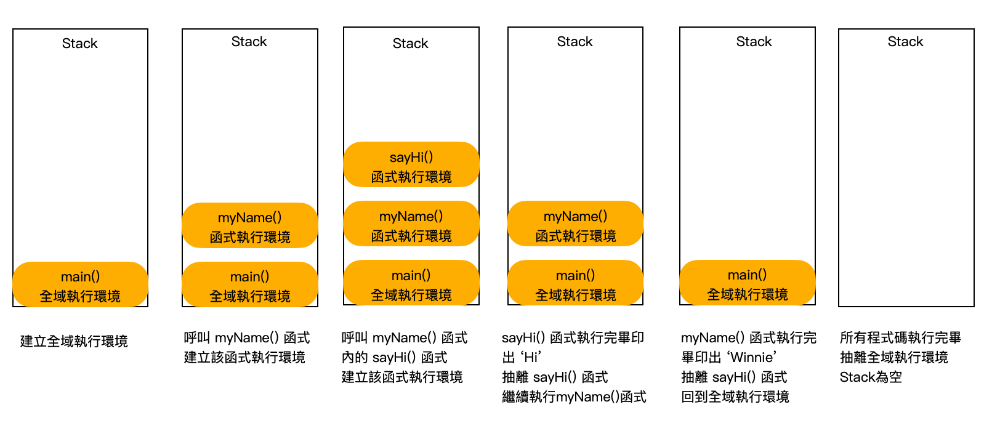
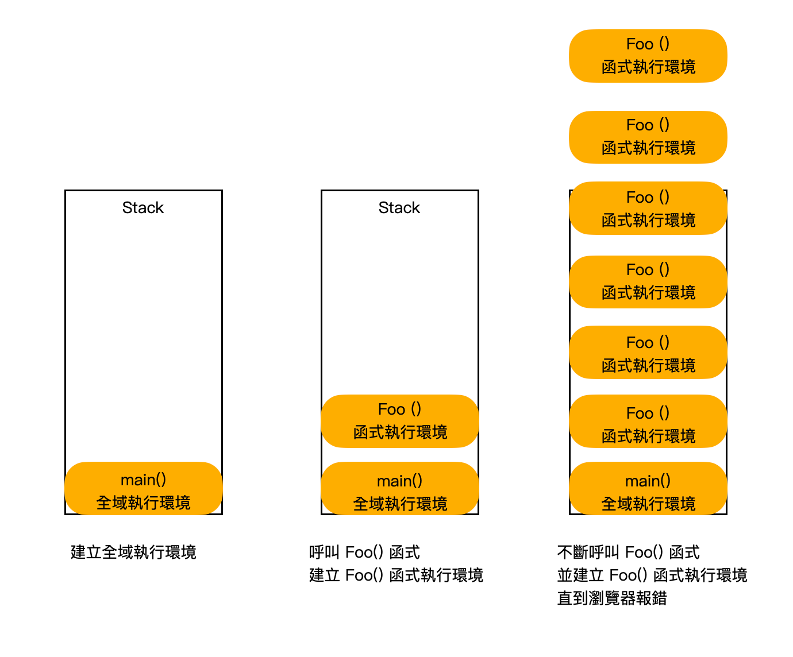

import CenterImage from "@site/src/components/helpers/CenterImage";


> *本文以 [What the heck is the event loop anyway? | Philip Roberts | JSConf EU](https://www.youtube.com/watch?v=8aGhZQkoFbQ) 這支影片為探討基礎。*

在正式開始說明 Event Loop 之前，將先針對 JavaScript 的特性進行說明，而後再往下討論 Web APIs、Callback Queue、Event Loop 跟 JavaScript 之間的關係。

## JavaScript

JavaScript 最早是為了透過瀏覽器與網頁互動而被發明的程式語言 (彌補靜態 HTML 的不足)，為了讓開發者能專注在程式開發上，被設計成單線程/單執行緒 (Single Thread Runtime)。

意即在同一時間一次只會執行一段放在堆疊 (Stack) 內的程式碼且程式碼是一行一行被執行的。

### V8 Engine

V8 引擎是 Google 開發的開源 JavaScript 引擎，裡面僅含有：

* **Memory Heap**：記憶體機制，主要執行記憶體分配 (Memory Allocation)，依照所宣告的變數、函式、物件等，將其儲存在相對應的儲存空間 (Stack or Heap)。

:::info[RECOMMENDED]
[Call stack & Memory heap](https://javascript-1.gitbook.io/javascript/call-stack-and-memory-heap.html)
:::

* **Call Stack**：執行堆疊，主要紀錄目前程式執行到哪個部分，也就是現在是在哪個執行環境 (Execution Context) 底下，而堆疊 (Stack) 的順序按照後進先出 (LIFO, Last In First Out) 的原理運作。

:::info[RECOMMENDED]
[Memory Life cycle Heap & Stack and Call Stack in JavaScript](https://blog.alexdevero.com/memory-life-cycle-heap-stack-javascript.html)
:::

堆疊的最上方是目前正在執行的程式，若函式中執行了 `return`，則將此函式從堆疊的最上方抽離 (Pop Off)，以下方的程式碼為例：

```javascript
function sayHi() {
  console.log('Hi')
}

function myName() {
  sayHi()
  console.log('Winnie')
}

myName()
// Hi
// Winnie
```

執行堆疊 (Call Stack) 的行為順序是：



當所有程式碼執行完畢，Stack 被清空，表示所有程式碼已經被執行完畢，並依照順序印出 Hi 和 Winnie。

### 無窮迴圈

若程式碼是個無窮迴圈：

```javascript
function foo () { 
 return foo ()
} 

foo()
```

Stack 就會不斷被堆疊上去，直到瀏覽器出錯：



由於 JavaScript 一次只能執行於 Stack 中最上層的程式碼，當 Stack 中的某一段程式碼不斷重複執行會造成無窮迴圈，導致瀏覽器報錯。

### 阻塞 (blocking)

而當 Stack 中的某一段程式碼執行過久，導致後續的程式碼無法執行，網頁怎麼操作都沒有反應，好像卡死的狀態，就可以稱為阻塞。

## 事件循環 (Event Loop)、Web APIs、事件佇列 (Callback Queue)

### 為何需要事件循環 (Event Loop)

Event Loop 做的事情其實很簡單，當堆疊為空，便把事件佇列中的第一個項目推進堆疊當中，讓堆疊去執行該項目。主要能解決的問題有以下兩個：

1. 協助非同步 (Asynchronous) 請求產生連貫的畫面。
2. 避免阻塞，將費時較久或需等待事情 (非同步) 的任務往後安排，打造較流暢的使用者體驗。

介紹完為何需要 Event Loop 後，繼續往下探討瀏覽器環境，以及瀏覽器環境、JavaScript 環境和 Event Loop 的關係。

### Web APIs

為瀏覽器環境所提供的各種 API 接口 (`setTimeOut`、`DOM`、`Ajax`...)，允許瀏覽器與 JS 做更多的互動。

瀏覽器並非只是一個 JavaScript 的運行環境 (Runtime)，還有很多 API 並不存在 V8 引擎內，而是存在於 Web APIs。

在瀏覽器的運行環境下，我們僅能透過呼叫來執行這些功能，並讓這些功能與我們的程式碼一同執行 (Concurrency)，當執行完畢，便會將執行完畢的函式，送進事件佇列 (Callback Queue) 內。

### 事件佇列 (Callback Queue)

會接收和儲存從 Web APIs 分發來的任務。

當 Stack 內的程式執行完畢，意即堆疊為空，便會透過 Event Loop 的特性，將位於 Callback Queue 內的第一個項目推進堆疊內被執行。

事件佇列是以先進先出 (FIFO, First-In-First-Out) 的原理運作。

## Event Loop 運作範例區

以下將以 `setTimeout` 和 `AJAX Request` 來詳細解析瀏覽器和 JS 之間是怎麼互相運作的。

* ### setTimeout 定時器 (非同步)

```javascript
console.log('hi')

setTimeout(function () {
  console.log('there')
}, 5000)

console.log('JSConfEU')

// hi
// JSConfEU
// there
```

由於 setTimeout 是瀏覽器提供的 API ，當 setTimeout 進入堆疊後，會直接被丟進 Web APIs 內去執行 5 秒。

5 秒後將該 Callback Function 排入事件佇列內等待 Stack 內的程式執行完畢後，由 Event Loop 重新送回堆疊內。

* ### AJAX request

```javascript
console.log('hi') 

$.get('url', function cb(data) {  
 console.log(data)
}) 

console.log('JSConfEU')

// hi
// JSConfEU
// data
```

和 setTimeout 一樣，AJAX Request 的功能並不在 V8 引擎中，而是存在於 Web APIs(XHR)。

發出請求後，不一定會被馬上回應，當收到回應後，才會進入事件佇列，接著被 Event Loop 重新推回堆疊內。

## 總結

JavaScript 是一種單執行緒 (一次只能做一件事) 的程式語言，但在瀏覽器環境中，除了 V8 引擎以外，還有瀏覽器所提供的各種 API 接口，像是 `setTimeOut`、`DOM`、`Ajax` 等等。

在 JavaScript 內我們僅能透過呼叫這些功能來讓他們可以和我們的程式碼一同執行，而當這些功能執行完畢後，就會被送進 Callback Queue 內。

Event Loop：
* 會持續查看 Stack 是否為空，若為空，則會將 Callback Queue 裡面的第一個項目推到 Stack 內執行。
* 主要協助非同步請求產生連貫的畫面，也能避免阻塞，可以打造較流暢的使用者體驗。