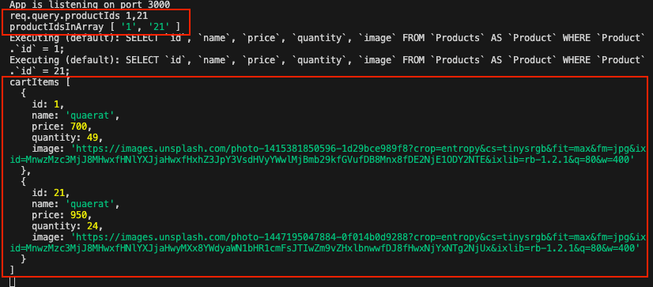

> *將購物車的資訊儲存在 Client 端，並透過 Local Storage + Axios 在全端開發內實現購物車功能。*
>
> *[Demo Project](https://github.com/winnielinn/ecommerce-website)*

## 過程

### 綁定監聽器

在商品頁的按鈕上綁定一個監聽器 `addCart`：

```html title="./views/product.hbs"
{{!-- in product.hbs --}}
<div class="row m-5">

    ...

    {{#if product.quantity}}
    <div class="btn-group mt-3">
      <button type="submit" class="btn btn-outline-secondary add-cart" data-id="{{product.id}}">加入購物車</button>
    </div>
    {{else}}
    <button type="button" class="btn btn-outline-secondary btn-lg" disabled>已售完</button>
    {{/if}}
  </div>
</div>

// highlight
<script src="/javascripts/addCart.js"></script>
```

當使用者點擊`加入購物車`時，`addCart` 就會同步把該商品的 `id` 存入 `localStorage`：

* 先取出 localStorage 內的資料並以陣列形式儲存，若無資料則為空陣列
* 確認目前被加入購物車的商品 id 是否已經存在於 localStorage
  * 若存在，跳出 alert
  * 若不存在，將商品 id 保存下來
* 將保存下來的商品 id 存回 localStorage

```javascript title="./public/javascript/addCart.js"
const button = document.querySelector('.add-cart')

function addToCart (event) {
  const list = JSON.parse(localStorage.getItem('cartItem')) || []

  if (list.some(item => item === event.target.dataset.id)) {
    return alert('該商品已在購物車中。')
  }

  list.push(event.target.dataset.id)

  localStorage.setItem('cartItem', JSON.stringify(list))
}

button.addEventListener('click', addToCart)
```

成功地將 `product_id` 存入 `localStorage` 且若要存入已存在的 `product_id` ，會同時跳出警告視窗告知使用者，避免重複加入：


### 撰寫 IIFE

:::info[REFERENCE]
[IIFE](https://medium.com/vicky-notes/%E7%AB%8B%E5%8D%B3%E5%87%BD%E5%BC%8F-iife-27fe4007e446) (Immediately Invoked Function Expression) 立即呼叫函式表達式，可以立即執行的 Functions Expressions 函式表達式。
:::

在 `getCart` 中會把從 `localStorage` 解析出來的 `productIds` 陣列轉為字串，以 `axios` 非同步請求將這些資料當作參數，傳入 API 內，以獲取商品相關資料：

```javascript title="./public/javascript/getCart.js"
(async function getCart () {
  'use strict'

  // 將存放在 localStorage 內的 id 拿出來
  const productIds = JSON.parse(localStorage.getItem('cartItem'))

  console.log(productIds) // ['1', '21']

  // 以 axios 方式呼叫 api 並取得相對應 product_id 的 product
  const response = await axios.get('/api/cartItems', {
    params: {
      productIds: productIds.toString() // 轉為字串後當作參數傳入 API
    }
  })

  .....

})()
```

### 引入 axios 和 IIFE

於購物車頁面，引入 [axios](https://axios-http.com/docs/intro) 和 `getCart`。

確保當使用者一抵達購物車頁面，`getCart` 就會將已經在 `localStorage` 內的 `productIds` 解析出來：

```html title="./views/cart.hbs"
<div class="row m-5">
  <h5 class="text-center">購物車</h5>
  <form action="/cart" method="POST">

    ....

  </form>
</div>

<script src="https://unpkg.com/axios/dist/axios.min.js"></script>
<script src="/javascripts/getCart.js"></script>
```

### 說明後端 API

透過 product_id 取得 product 的 API `/api/cartItems`：

```javascript title="./services/api-service.js"
getProductsInCart: async (req, res, next) => {
  try {
    console.log(req.query.productIds) // 1, 21
    
    // 將傳入的參數 productIds 轉為陣列
    const productIdsInArray = req.query.productIds.split(',')

    console.log(productIdsInArray) // ['1', '21']

    const cartItems = []

    // 將該 productIds 陣列內的 product Id 以丟回資料庫查詢
    for (let i = 0; i < productIdsInArray.length; i++) {
      const product = await Product.findOne({
        where: {
          id: parseInt(productIdsInArray[i], 10) // 將字串轉為數字
        },
        attributes: [
          'id', 'name', 'price', 'quantity', 'image'
        ]
      })

      // 查出來的資料丟進另一個要回傳的陣列
      cartItems.push(product.get({ plain: true }))
    }

    // 將所有 product 資訊丟回去
    return res.json(cartItems)
  } catch (err) {
    console.error(err)
  }
}
```

從以下的結果可以得知：



* `axiso` 將解析出來的字串傳入 API `/api/cartItems`
* 透過 `split` 將 `String` 轉為 `Array`，並將陣列內的每個值 (product_id) 帶入資料庫進行查詢
* 被查詢到的 `product`，會被丟入 `cartItems` 的陣列內存放起來
* 當查詢結束，直接回傳陣列 `cartItems` 給 `getCart.js`

### 渲染購物車頁面

購物車頁面接到的 `response` 是經由後端 API 處理過後的資料，包含了所有被加入購物車內的商品資訊。

最後只要將這些資訊動態渲染回頁面，就能夠呈現出完整的購物車頁面：

```javascript title="./public/javascript/getCart.js"
(async function getCart () {
  .....

  const products = response.data

  // 將獲取的 product 資料動態渲染頁面
  const cart = document.querySelector('.cart')

  let rawHTML = ''

  for (let i = 0; i < products.length; i++) {
    rawHTML += `
    <tr>
      // 放入 product[i] 的資訊
    </tr>
    `
  }

  cart.innerHTML = rawHTML
})()
```

## 結果

透過自行定義 API，並在渲染頁面時同時執行 IFEE，再以 axios 非同步請求 API，獲取產品資訊，在短短的幾秒鐘內，完成購物車頁面的渲染：

