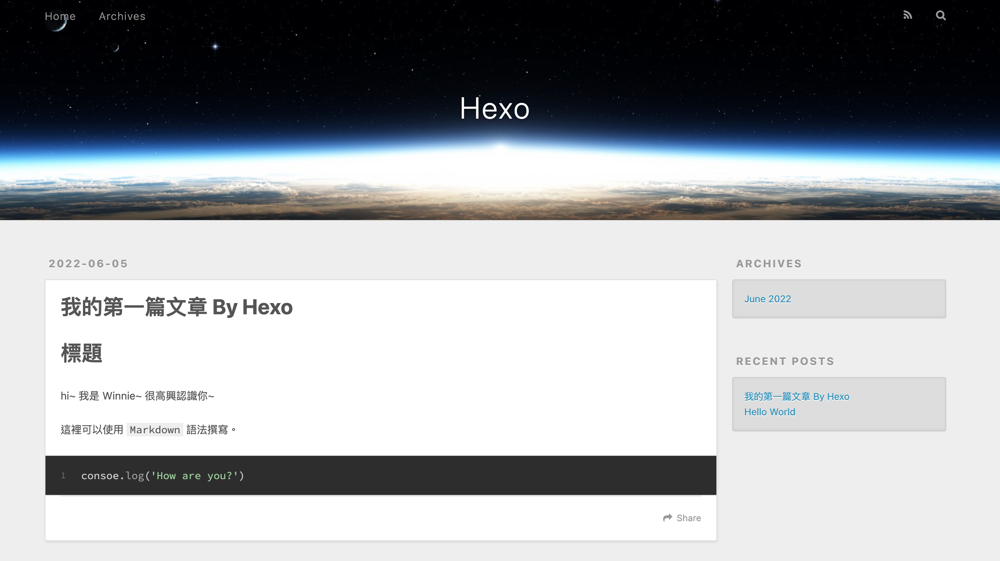

## 介紹

Hexo 是一個基於 Node.js 開發的網誌框架，具有下列優點：

* 編譯速度快
* 支援 Markdown 語法撰寫
* 一鍵部署至 GitHub Pages、Heroku 等其他支援靜態網頁的空間
* 豐富的外掛套件


## 前置作業

確保電腦內已經安裝以下軟體：

* Node.js
* Git

## 架設過程

### 安裝

根據[官方文件](https://hexo.io/zh-tw/docs/)，輸入以下指令進行安裝：

```bash npm2yarn
npm install -g hexo-cli
```

可透過 `hexo -v` 確認是否安裝成功並查看 Hexo 版本。

### 建立專案

* 切換到想建立 Hexo 專案的路徑下，初始化 Hexo 並產生一個 `blog` 資料夾：

```bash npm2yarn
hexo init blog
```

* 切換到 Hexo 產生的專案資料夾，安裝 Hexo 所需要的套件：

```bash npm2yarn
npm install
```

### 介紹目錄結構

```Text
.
├── .github
├── node_modules
├── scaffolds
├── source
|   ├── _drafts
|   └── _posts
├── themes
├── _config.landscape.yml
├── _config.yml
├── .gitgnore
├── db.json
├── package-lock.json
└── package.json
```

* `.github`：與部署相關。
* `node_modules`：存放所有安裝的套件。
* `scaffolds`：根據 `draft.md`、`post.md`、`post.md` 初始化一篇文章。
* `source`：存放原始檔案的地方。
    * 舉凡 Markdown 和 HTML 檔案都是放在這。
    * 可以加上 `_` 來隱藏資料夾和檔案 ( `_post` 不受影響)。
* `themes`：放置 Hexo 主題的資料夾。
* `_config.yml` 是 Hexo 的主要網站[設定檔](https://hexo.io/zh-tw/docs/configuration)，與主題的 `.yml` 不同。
* `.gitgnore`：含有那些不會被上傳至 Git 的檔案和資料夾的名稱。
* `db.json`：緩存文件，可以使用 `hexo clean` 清除。
* `package-lock.json`：記錄當前狀態安裝的每一個套件版本。
* `package.json`：放置並管理透過 npm 下載回來的檔案，也可以將部分指令直接寫在裡面，方便開發。

### 選擇主題

Hexo 提供了各式各樣的[主題](https://hexo.io/themes/)進行挑選，預設主題是 `landscape`。

## 指令

### 建立新文章

```bash npm2yarn
hexo new post "我的第一篇文章 By Hexo"
```

輸入指令之後，會發現 `source` 的 `_posts` 資料夾多了一個 `我的第一篇文章-By-Hexo.md` 的檔案。

### 文章撰寫

主要透過 `Markdown` 進行撰寫，可以透過上下兩個 `---` 來敘述文章的屬性。

```Markdown
---
title: 我的第一篇文章 By Hexo
date: 2022-06-05 18:21:16
tags:
---

# 標題

hi~ 我是 Winnie~ 很高興認識你~

這裡可以使用 `Markdown` 語法撰寫。
```

### 啟動伺服器

透過以下指令，啟動本地伺服器：

```bash npm2yarn
hexo server
```

終端機會顯示 `Hexo is running at http://localhost:4000/`：



### 清除暫存檔案

有時候可能會遇到因為快取檔案 (`db.json`) 以及編譯檔案 (`public`) 的關係，導致有一些更改的資訊沒有成功顯示。

這時候可以輸入以下指令，將其清除：

```bash npm2yarn
hexo clean
```

## 部署至 Github Pages

### 建立專案

新增一個**公開**的 Repsoitory 命名為 `[你的 GitHub 帳號].github.io`：


這樣就代表成功建立了一個網域 `[你的 GitHub 帳號].github.io` 。

### 將檔案發佈到 Git

#### 安裝 Git 相關套件

```bash npm2yarn
npm install hexo-deployer-git --save
```

### 修改設定檔

修改部署及 URL 設定：

```yml title="./_config.yml"
# Deployment
## Docs: https://hexo.io/docs/one-command-deployment

deploy:
  type: git
  repo: https://github.com/[你的 GitHub 帳號]/[你的 GitHub 帳號].github.io.git 
    # https://github.com/winnielinn/winnielinn.github.io.git

  branch: main # 預設分支名稱

....

# URL
## Set your site url here. For example, if you use GitHub Page, set url as 'https://username.github.io/project'

url: http://yoursite.com
  # https://winnielinn.github.io
```

### 部署指令

輸入 `hexo deploy` 後，就能部署檔案到網站上。

可以回到 Repsoitory 內的 Setting 的 Pages 確認是否部署成功：


出現 **Your site is published at `https://your_github_account.github.io`**，那就代表部落格部署成功囉！

:::tip[TIP]
避免更新不夠完全，建議每次部署都可以依序輸入：

* `hexo cl` (清除之前建立的靜態檔案)
* `hexo g` (建立靜態頁面)
* `hexo d` (部署至 GitHub)
:::