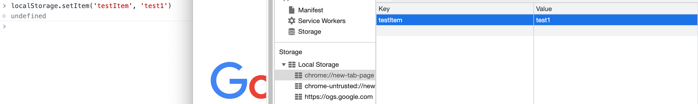
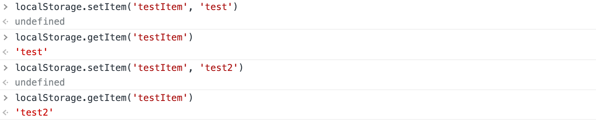
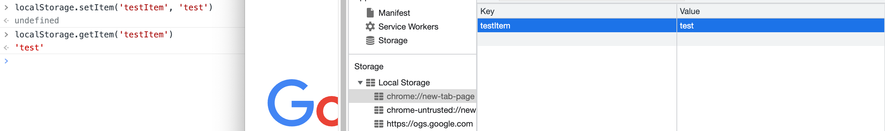
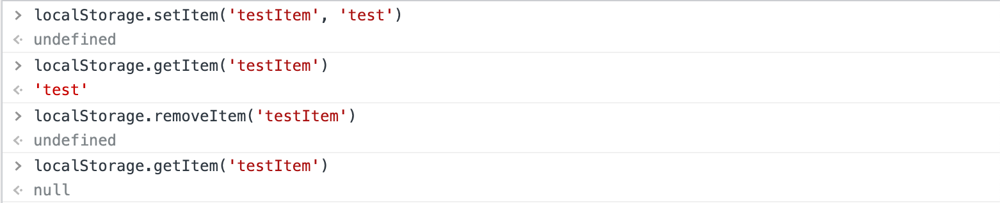
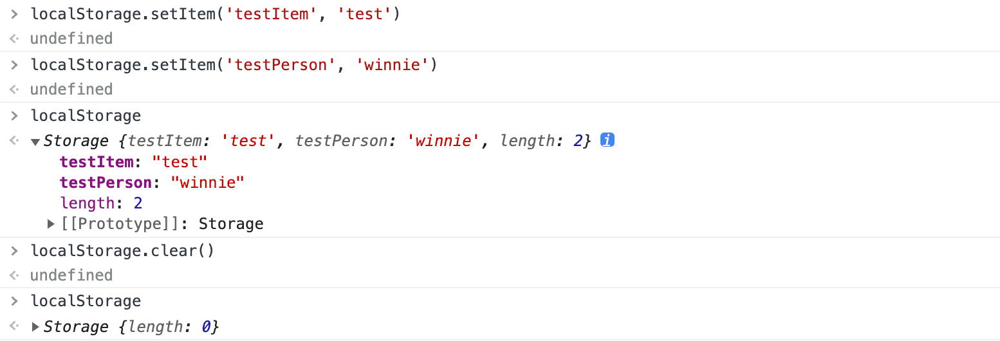

## Cookie

* 儲存在瀏覽器上的小型文字資料，限制大小為 4 K。
* 每次 Request 都會夾在 Header 內一起傳送過去，因此當 Cookie 容量越高，效能會相對降低。
* 可自行設定失效時間，預設是關閉瀏覽器後失效。
* 每個瀏覽器限制的 Cookie 數量皆不相同。

### 分類

Cookie 可以根據網域的所有權分為第一方 (First-Party) 和第三方 (Third-Party)：

#### 第一方 Cookie

是由使用者正在瀏覽的網站，也就是目前網址列所顯示的網址所建立，主要是用來**優化用戶體驗的基礎**。

當使用者瀏覽該網域的網站，第一方網站會紀錄使用者的資訊及登入狀況，讓我們在下次造訪該網域的網站時不用重複登入，提升瀏覽體驗。

#### 第三方 Cookie

是由使用者造訪的第一方網站上的其他網站所建立，主要用來**跨網站追蹤用戶紀錄**。

在第一方網站顯示網路廣告，或是使用者點擊網站顯示的廣告時，第一方網站除了會收到使用者的 Cookie 外，也會收到來自廣告伺服器的 Cookie，因此稱作第三方 Cookie。

第三方 Cookie 會跨網域獲取使用者的瀏覽紀錄資訊，並用來發布該使用者可能關注的廣告。

### 應用

* 與 Session 合併使用：使用者驗證、遊戲分數或者是一些不需要保存在伺服器的簡單資訊。
* 個人化：使用者設定、佈景主題以及其他設定等等。
* 追蹤：紀錄並分析使用者行為。

:::info[REFERENCE]
[Cookie & Session](https://winnielin-tech.vercel.app/docs/webdev/cookie-session/)
:::

## Web Storage

* 是 HTML5 提供另一種在客戶端儲存資料的方式，儲存空間可到 5MB 左右，彌補了 Cookie 儲存量小、以及不適合在本地儲存大量資料的問題。
* 以 Key-Value 形式儲存於瀏覽器中，但只能儲存字串。
* 不與伺服器交互作用，不會佔用網路頻寬。
* 提供 API 操作： `getItem`、`setItem`、`removeItem`、`clear`。

### localStorage

將資料永久儲存於客戶端，同網域底下皆可存取，除非手動刪除。

### sessionStorage

只儲存在開啟的瀏覽器頁面中，瀏覽器或分頁關閉就消失。

### 應用

以下以 localStorage 來進行相對應 API 操作的示範：

#### 新增 & 更新

```javascript
localStorage.setItem('testItem', 'test1')
```

可透過 Console 內的 localStorage 內查看新增的 Item：



```javascript
localStorage.setItem('testItem', 'test2')
```

更新已存在的 Key 的 Value，相同的 Key 會直接覆蓋原有的 Value：



#### 查詢

```javascript
localStorage.getItem('testItem')
```

可透過自定義的 Key 來取得對應的 Value：



#### 刪除

* 指定要刪除的 Key：

```javascript
localStorage.removeItem('testItem')
```

可以帶入自定義的 Key 來刪除對應的 Value：



* 刪除全部的 Key：

```javascript
localStorage.clear()
```

刪除 localStorage 儲存的所有資料：



## 總結

藉由 Cookie 和 Web Storage，讓我們不必把所有的資訊都放在伺服器端，可以選擇將一些簡單資訊存放在瀏覽器。

* Cookie：與伺服器交互作用，每次請求都會將 Cookie 夾帶在 Header 內傳送過去給伺服器。
* Web Storage：分為 localStorage 和 sessionStorage，儲存空間較 Cookie 大，sessionStorage 在瀏覽器或分頁關閉後就消失。