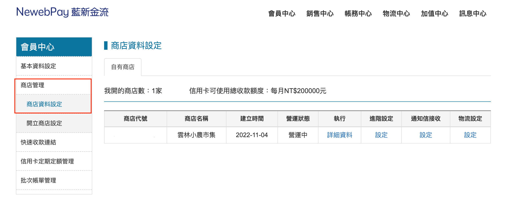
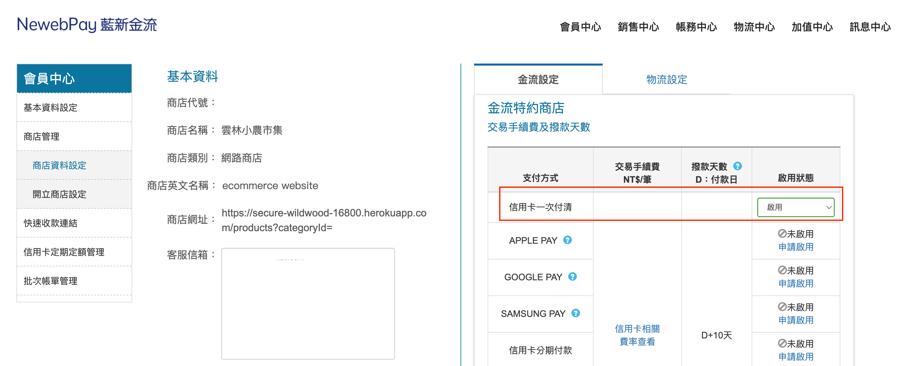
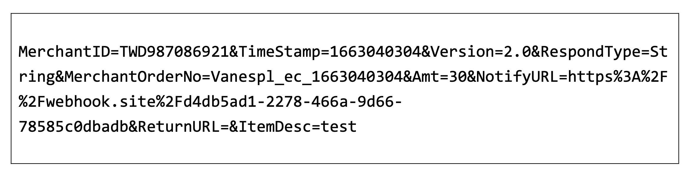
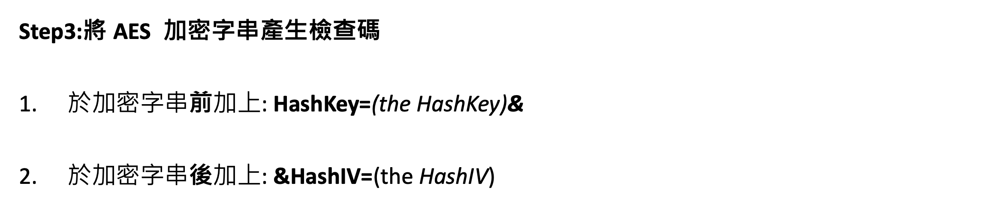
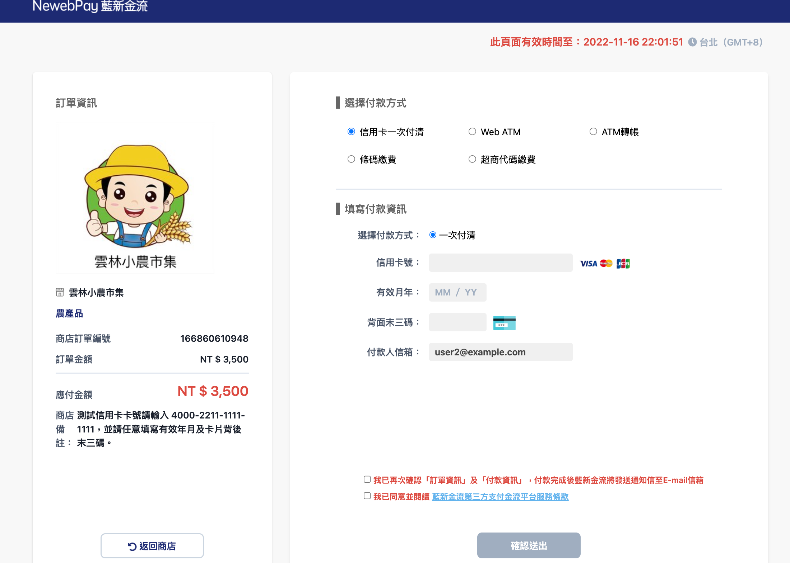
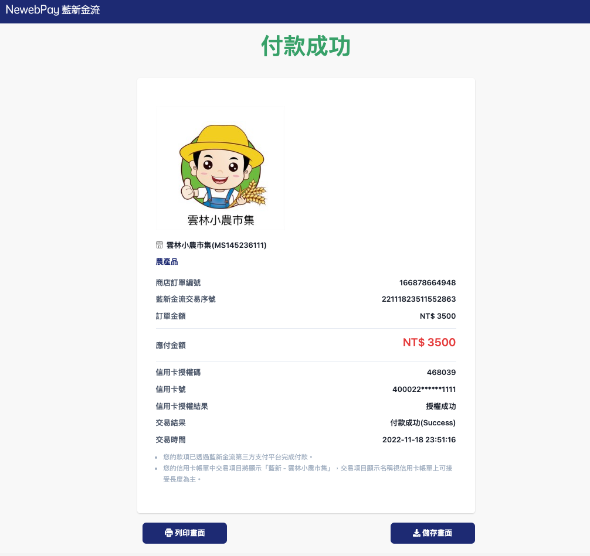

import CenterImage from "@site/src/components/helpers/CenterImage";

> *藍新金流 API 的串接 Sample 是以 PHP 實作，本文將介紹如何改用 node.js 串接以及展示實作過程。*
> 
> *[Demo Project](https://github.com/winnielinn/ecommerce-website)*

## 事前準備

:::tip[TIP]
建立在開始串接之前，可以先大致閱讀一下串接的 [API 文件](https://www.newebpay.com/website/Page/content/download_api#2)內的**交易流程**，會對流程會有一定程度的認識。
:::

### 藍新設定

在[藍新金流平台測試區](https://cwww.newebpay.com/)建立商店：



並於商店建立後，啟動支付工具：



### 重要參數

取得**商店代號 (Merchant ID)**和**商店 API 串接金鑰 (Hash Key & Hash IV)**：

<CenterImage src={require('./img/newebpay-3-api-token.png').default} alt="Success"/>

在 API 傳遞時需要進行加密的必要參數如下：

* MerchantID：藍新金流商店代號
* RespondType：回傳格式 (JSON 或是 String)
* TimeStamp：時間戳記
* Version：串接版本
*  MerchantOrderNo：商店訂單編號 (自訂，限制英文或是數字)
*  Amt：訂單金額
*  ItemDesc：商品資訊 (自訂，限制長度為 50 字元)

```javascript title="./utils/newebpay-payment.js"
const data = {
  MerchantID: '藍新金流商店代號',
  RespondType: 'JSON',
  TimeStamp: Date.now(),
  Version: '2.0',
  MerchantOrderNo: 'TEST ORDER',
  Amt: '1000',
  ItemDesc: 'TEST PRODUCT NAME',
}
```

## 串接流程

### 拼接請求字串

將預先設置好要進行加密的必要參數拼接成以下的請求字串格式：



將準備好的資料，傳入 `genDataChain` 內，獲得拼接後的請求字串。

```javascript title="./utils/newebpay-payment.js"
function genDataChain (data) {
  const results = []
  // 透過 Object.entries 歷遍所有 key 和 value 並傳入陣列
  for (const item of Object.entries(data)) {
    results.push(`${item[0]}=${item[1]}`)
  }
  // 以 join 方式用 '&' 轉換成字串
  return results.join('&')
}

const updatedData = genDataChain(data)
// MerchantID=藍新金流商店代號&RespondType=JSON ...
```

### AES-256 加密

將請求字串和 HashKey & HashIV 以 AES-256 進行加密。

:::tip[TIP]
可透過 [crypto](https://blog.logrocket.com/node-js-crypto-module-a-tutorial/) 套件來協助在 node.js 中進行加密。
:::

將 Key 和 IV 欄位的值分別帶入 HashKey 和 HashIV，取得第一次加密後的資料。

```javascript title="./utils/newebpay-payment.js"
function enecryptTradeInfoAES (updatedData) {
  // highlight
  const encrypt = crypto.createCipheriv('ase256', HashKey, HashIV) 
  const encrypted = encrypt.update(updatedData, 'utf8', 'hex')
  return encrypted + encrypt.final('hex')
}

const TradeInfo = enecryptTradeInfoAES(updatedData)
```

### SHA-256 加密



將第一次加密得出的結果和 HashKey & HashIV 進行 SHA-256 加密，產生檢查碼，並把產出來的檢查碼轉換成大寫：

```javascript title="./utils/newebpay-payment.js"
function hashTradeInfoSHA (TradeInfo) {
  const sha = crypto.createHash('sha256')
  const plainText = `HashKey=${HashKey}&${TradeInfo}&HashIV=${HashIV}`
  return sha.update(plainText).digest('hex').toUpperCase()
}

const TradeSha = hashTradeInfoSHA(TradeInfo)
```

### 回傳加密資料

要把以下這些參數透過 `POST` 方法傳遞給 `https://ccore.newebpay.com/MPG/mpg_gateway`：

* MerchantID (藍新金流商店代號)
* TradeInfo (第一次加密結果)
* TradeSha (第二次加密結果)
* Version (版本號)

```html
<form name="newebPay" action="https://ccore.newebpay.com/MPG/mpg_gateway" method="POST">

    {{! 明碼參數 MID = MerchantID }}
    <input
    type="text"
    name="MerchantID"
    value="MS11108176"
    hidden
    />

    {{! 加密後參數 TradeInfo }}
    <input
    type="text"
    name="TradeInfo"
    value="880a99235e39367d7cbf64a28b6cd62"
    hidden
    />

    {{! 壓碼參數 TradeSha }}
    <input
    type="text"
    name="TradeSha"
    value="09E77F048EF3D1683DF7A52B762FF9049"
    hidden
    />

    {{! 版本 Version}}
    <input type="text" name="Version" value="2.0" hidden />

    <button type="submit" class="btn btn-danger my-3">確定付款</button>
</form>
```

如果以上步驟都順利完成的話，按下確定付款的按鈕後，將會成功進入藍新金流的付款頁面：



### 呼叫 Callback

呼叫 Callback Function 並且透過 [crypto](<https://blog.logrocket.com/node-js-crypto-module-a-tutorial/>) 套件取得解密後的交易資料。

:::warning[WARNING]
沒有設定 Callback，會在填寫完付款資訊送出時出錯。
:::

```javascript title="./app.js"
app.post('/newebpay/callback', orderController.newebpayCallback)
```

```javascript title="./controllers/order-controller.js"
const orderController = {
  newebpayCallback: async (req, res, next) => {
    try {
      // 取得解密後的交易資料
      const decrypt = JSON.parse(decryptTradeInfoAES(req.body.TradeInfo))
      console.log(decrypt)
    } catch (err) {
      next(err)
    }
  }
}
```

```javascript title="./utils/newebpay-payment.js"
function decryptTradeInfoAES (TradeInfo) {
    const decrypt = crypto.createDecipheriv('aes256', HashKey, HashIV)
    decrypt.setAutoPadding(false)
    const text = decrypt.update(TradeInfo, 'hex', 'utf8')
    const plainText = text + decrypt.final('utf8')
    const result = plainText.replace(/[\x00-\x20]+/g, '')
    return result
}
```

加入 Callback 後付款成功：



## 成果


