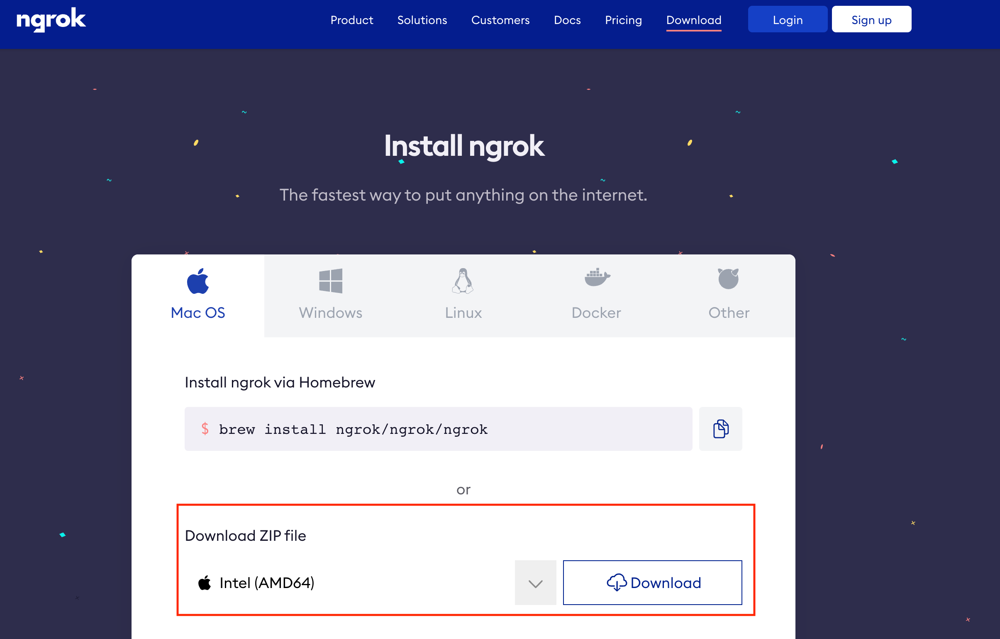
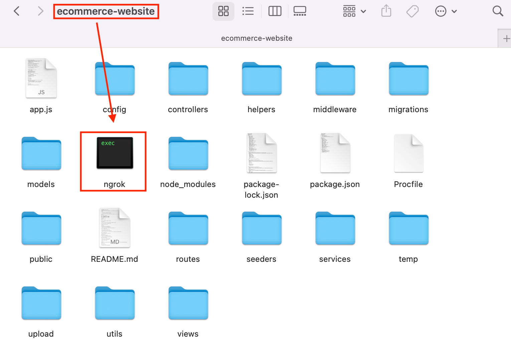
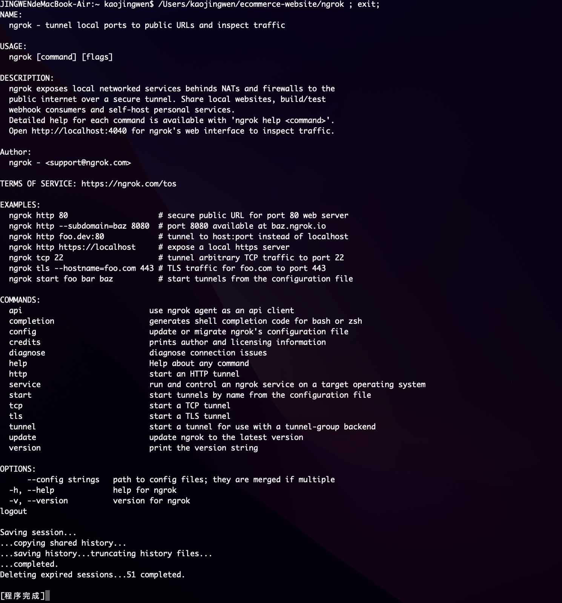
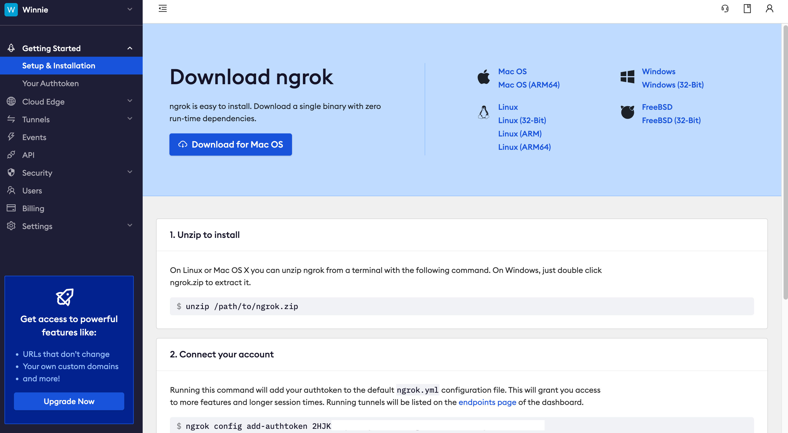
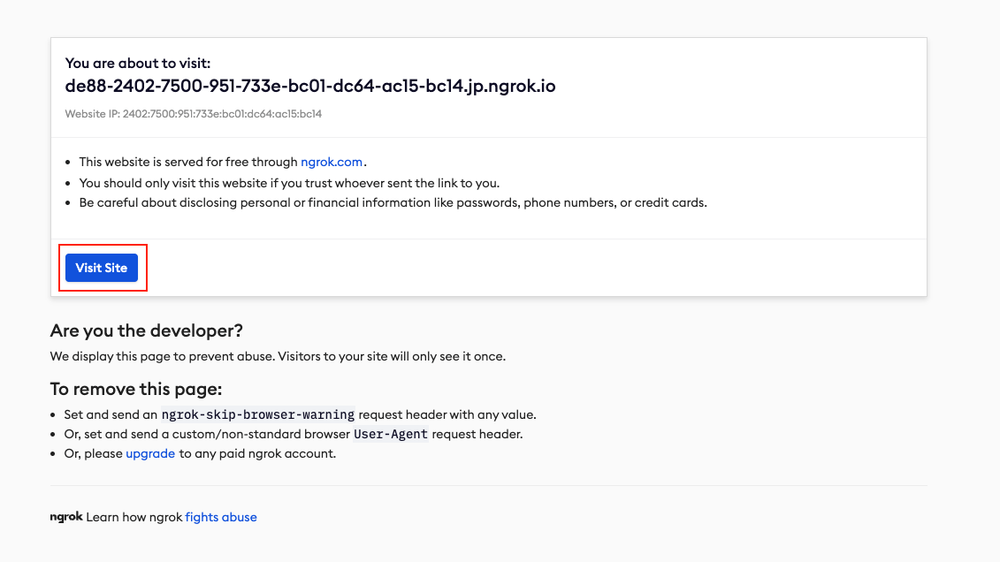
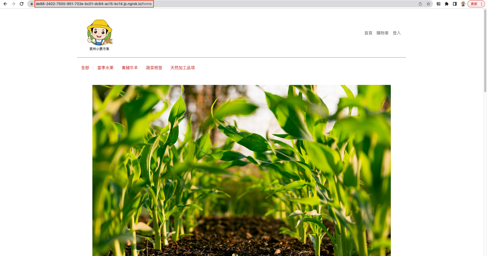

import CenterImage from "@site/src/components/helpers/CenterImage";

## 介紹

[Ngrok](https://ngrok.com) 作為一個轉發的伺服器，可以將外界的請求轉發到使用者本機指定的 Port。

背後原理是連接到 Ngrok 雲端伺服器，將使用者本機指定的地址公開，再由 Ngrok 去產生一串公開的網址讓外網存取本機上的 Port。

簡單來說，就是將原先只能在本機跑起來的 `http://localhost:YOUR_PORT/` 轉成一串能公開在整個網際網路中的網址，讓使用者可以真正在外界進行測試。

## 使用步驟

1. 到 [Ngrok 官網](https://ngrok.com/)下載 ZIP 安裝檔



2. 下載完畢並且解壓縮後，會出現一個 Ngrok 的執行檔

<CenterImage src={require('./img/ngrok-2-unzip.png').default} alt="Un-zip"/>

3. 將 Ngrok 放在需要轉址的專案資料夾內



4. 執行專案底下的 Ngrok，完成後會跳出終端機畫面：



5. 從官網註冊一個帳號後，取得 [Token](https://dashboard.ngrok.com/get-started/setup)



6. 開啟專案底下的一個新的 Terminal 並輸入以下 Command：

```bash
$ ./ngrok config add-authtoken <YOUR_AUTH_TOKEN>
```

:::tip[TIP]
完成輸入後會出現以下訊息：

`Authtoken saved to configuration file: /Users/YourName/Library/Application Support/ngrok/ngrok.yml`

代表已經成功將 Authtoken 已經存到 Configuration 了。
:::

7. 接著輸入以下指令，代表我們要在哪一個 PORT 上啟動 HTTP 通道：

```bash
$ ./ngrok http <YOUR_PORT>
```

終端機出現以下訊息，就代表可以成功透過該網址直接讓 `localhost` 對外進行測試囉！

<CenterImage src={require('./img/ngrok-6-success.png').default} alt="Success"/>

## 備註

:::warning[NOTICE]
關閉 Server，網址也會失效，下次要重啟新的網址。
:::

如果是第一次輸入 Ngrok 產生的外網網址，會先跳出以下頁面：



這時候跟著操作按下 `Visit Site` 的按鈕，就可以順利看到專案的畫面了。

並且網址不是本機的 `localhost`，而是 Ngrok 產生的網址：

